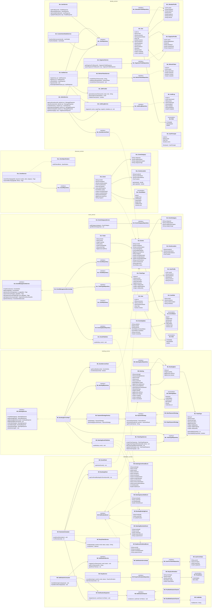

```mermaid
classDiagram
direction LR

namespace identity_service {
  class Idn_User {
    +UUID id
    +String email
    +String username
    +String passwordHash
    +Role role
    +boolean isActive
    +String firstName
    +String lastName
    +String phone
    +String avatarUrl
    +String bio
    +String location
    +Instant createdAt
    +Instant updatedAt
  }
  class Idn_AttendeeProfile {
    +UUID userId
    +String firstName
    +String lastName
    +String phone
    +String avatarUrl
    +String timezone
    +String interest
  }
  class Idn_OrganizerProfile {
    +UUID userId
    +String displayName
    +String bio
    +String websiteUrl
    +String contactEmail
    +String instagramUrl
  }
  class Idn_RefreshToken {
    +UUID id
    +UUID userId
    +String tokenHash
    +Instant expiresAt
    +boolean revoked
    +Instant createdAt
  }
  class Idn_AuditLog {
    +UUID id
    +UUID actorUserId
    +String action
    +String targetType
    +String targetId
    +Map metadata
    +String ipAddress
    +Instant createdAt
  }
  class Idn_Role {
    <<enumeration>>
    ATTENDEE
    ORGANIZER
    ADMIN
  }
  class Idn_AuthService {
    +register(req, ip) AuthResponse
    +login(req, ip) AuthResponse
    +refresh(token) AuthResponse
    +logout(userId) void
    +bootstrapInitialAdmin(req, ip) AuthResponse
  }
  class Idn_UserService {
    +getProfile(userId) ProfileResponse
    +getUserById(userId) UserResponse
    +getUserByEmail(email) UserResponse
    +updateProfile(userId, req) ProfileResponse
  }
  class Idn_AdminService {
    +approveEvent(eventId, adminId, ip) MessageResponse
    +rejectEvent(eventId, adminId, ip) MessageResponse
    +createAdmin(req, creatorId, ip) UserResponse
    +deactivateUser(targetId, actorId, ip) MessageResponse
    +deleteUser(targetId, actorId, ip) MessageResponse
    +getAllUsers(page, size) PagedUsersResponse
  }
  class Idn_OrganizerService {
    +getOrganizerProfile(userId) OrganizerProfileResponse
    +upsertOrganizerProfile(userId, req) OrganizerProfileResponse
  }
  class Idn_RefreshTokenService {
    +createRefreshToken(userId) String
    +validateAndRotate(token) RefreshToken
    +revokeAllUserTokens(userId) void
  }
  class Idn_AuditLogService {
    +log(actorId, action, targetType, targetId, metadata, ip) void
  }
  class Idn_JwtProvider {
    +generateAccessToken(userId, email, role) String
    +getUserIdFromToken(token) UUID
    +validateToken(token) boolean
  }
  class Idn_UserPrincipal {
    +UUID id
    +String email
    +Role role
    +boolean active
    +from(user) UserPrincipal
  }
  class Idn_CustomUserDetailsService {
    +loadUserByUsername(email) UserDetails
    +loadUserById(id) UserDetails
  }
  class Idn_UserRepository {
    <<interface>>
  }
  class Idn_AttendeeProfileRepository {
    <<interface>>
  }
  class Idn_OrganizerProfileRepository {
    <<interface>>
  }
  class Idn_RefreshTokenRepository {
    <<interface>>
  }
  class Idn_AuditLogRepository {
    <<interface>>
  }
  class Idn_EventServiceClient {
    <<interface>>
  }
}

namespace event_service {
  class Evt_Events {
    +String eventId
    +String eventName
    +String eventDescription
    +Long maxCapacity
    +Long waitlistCapacity
    +BigDecimal ticketPrice
    +String imageUrl
    +Instant eventStartInstant
    +Instant eventEndInstant
    +Instant eventPublishInstant
    +String eventTimeZone
    +UUID eventOwnerId
    +String approverId
    +EventStatus status
  }
  class Evt_EventCategory {
    +String categoryId
    +String categoryName
    +String categoryDescription
    +String categoryImage
  }
  class Evt_EventLocation {
    +String locationId
    +String locationName
    +String locationAddress
    +Point location
  }
  class Evt_EventUpdates {
    +String updateId
    +String eventId
    +String adminId
    +EventStatus previousStatus
    +EventStatus newStatus
    +String comments
    +Instant reviewDate
  }
  class Evt_TicketType {
    +String id
    +String eventId
    +String ticketType
    +String description
    +BigDecimal price
    +Integer totalQuantity
    +Integer waitlistCapacity
    +Integer soldQuantity
  }
  class Evt_Ticket {
    +String ticketId
    +String userId
    +Integer quantity
    +String status
    +Instant bookingDate
    +String ticketType
    +BigDecimal totalPrice
  }
  class Evt_User {
    +UUID id
    +String username
    +String userEmail
    +String passwordHash
    +Role roles
    +boolean isActive
  }
  class Evt_UserProfile {
    +UUID userId
    +String firstName
    +String lastName
    +String phone
    +String avatarUrl
    +String timezone
  }
  class Evt_UserRole {
    +String roleId
    +String roleName
    +String roleDescription
    +String roleStatus
  }
  class Evt_EventStatus {
    <<enumeration>>
    DRAFT
    SUBMITTED
    APPROVED
    REJECTED
    PUBLISHED
    COMPLETED
    CANCELLED
  }
  class Evt_Role {
    <<enumeration>>
    ATTENDEE
    ORGANIZER
    ADMIN
  }
  class Evt_EventManagementService {
    <<interface>>
    +createEvent(event) EventInfoDto
    +getEventById(id) EventInfoDto
    +getAdminEventsPage(status, q, pageable) Page
    +getActiveEventsPage(q, pageable) Page
    +getOrganizerEventsPage(orgId, tab, pageable) Page
    +getOrganizerSummary(orgId) OrganizerEventSummaryDto
    +getAdminMetrics() EventAdminMetricsDto
  }
  class Evt_EventManagementServiceImpl
  class Evt_EventCategoryService {
    +addCategory(category) EventCategory
    +getAllEventCategories() List
  }
  class Evt_EventPublisher {
    +publish(key, event) void
  }
  class Evt_EventRepository {
    <<interface>>
  }
  class Evt_EventCategoryRepository {
    <<interface>>
  }
  class Evt_EventUpdatesRepository {
    <<interface>>
  }
  class Evt_TicketRepository {
    <<interface>>
  }
  class Evt_TicketTypeRepository {
    <<interface>>
  }
  class Evt_UserRepository {
    <<interface>>
  }
}

namespace booking_service {
  class Bk_Booking {
    +String bookingId
    +String bookingReference
    +String eventId
    +String userId
    +String userEmail
    +BookingStatus status
    +BigDecimal totalAmount
    +String paymentMethod
    +String paymentTransactionId
    +String ticketType
    +Integer quantity
    +BigDecimal unitPrice
    +BigDecimal subtotal
    +Instant createdAt
    +Instant updatedAt
    +Instant cancelledAt
  }
  class Bk_BookingItem {
    +String id
    +Integer quantity
    +BigDecimal unitPrice
    +BigDecimal subtotal
  }
  class Bk_TicketType {
    +String id
    +String eventId
    +String ticketType
    +String description
    +BigDecimal price
    +Integer totalQuantity
    +Integer waitlistCapacity
    +Integer soldQuantity
    +getAvailableQuantity() int
    +hasAvailability(requested) boolean
  }
  class Bk_BookingStatus {
    <<enumeration>>
    PENDING
    CONFIRMED
    CANCELLED
    REFUNDED
    FAILED
    CHECKED_IN
  }
  class Bk_BookingService {
    <<interface>>
    +createBooking(req) BookingResponse
    +getBookingById(id) BookingResponse
    +getBookingByReference(ref) BookingResponse
    +getBookingsByUser(userId) List
    +confirmBooking(id) BookingResponse
    +cancelBooking(id) BookingResponse
    +checkInBooking(id) BookingResponse
    +deleteBooking(id) void
  }
  class Bk_BookingServiceImpl
  class Bk_TicketTypeService {
    +createTicketType(req) TicketTypeResponse
    +assignTicketTypesToEvent(eventId, items) List
    +getTicketTypesByEvent(eventId) List
    +updateTicketType(id, req) TicketTypeResponse
    +deleteTicketType(id) void
  }
  class Bk_PaymentStrategy {
    <<interface>>
    +processPayment(req) PaymentResult
    +processRefund(txnId, amount) PaymentResult
    +getProviderName() String
  }
  class Bk_MockPaymentStrategy
  class Bk_StripePaymentStrategy
  class Bk_PaymentStrategyFactory {
    +getStrategy() PaymentStrategy
    +getStrategy(providerName) PaymentStrategy
  }
  class Bk_EventServiceClient {
    +getEventById(eventId) EventInfoDto
    +eventExists(eventId) boolean
  }
  class Bk_BookingEventPublisher {
    +publish(key, event) void
  }
  class Bk_BookingRepository {
    <<interface>>
  }
  class Bk_BookingItemRepository {
    <<interface>>
  }
  class Bk_TicketTypeRepository {
    <<interface>>
  }
}

namespace notification_service {
  class Ntf_UserFcmToken {
    +String userId
    +String fcmToken
    +String userEmail
    +Instant updatedAt
  }
  class Ntf_RsvpConfirmation {
    +String bookingId
    +String eventId
    +String userEmail
    +RsvpStatus status
    +Instant respondedAt
  }
  class Ntf_RsvpStatus {
    <<enumeration>>
    CONFIRMED
    DECLINED
  }
  class Ntf_NotificationEvent {
    <<interface>>
  }
  class Ntf_BookingConfirmedEvent {
    +String bookingId
    +String eventId
    +String userId
    +String userEmail
    +String userName
    +String eventName
    +Instant eventStartInstant
    +Instant eventEndInstant
    +String eventTimeZone
    +String eventLocationName
    +String eventLocationAddress
    +int ticketQuantity
    +double totalAmount
  }
  class Ntf_BookingCancelledEvent {
    +String bookingId
    +String userEmail
    +int ticketQuantity
    +double refundAmount
  }
  class Ntf_BookingPendingEvent {
    +String bookingId
    +String userEmail
    +int waitlistPosition
  }
  class Ntf_BookingReminderEvent {
    +String bookingId
    +String eventId
    +String userEmail
    +String rsvpConfirmUrl
    +String rsvpDeclineUrl
  }
  class Ntf_NewEventPublishedEvent {
    +String eventId
    +String eventName
    +Instant eventStartInstant
    +String organizerName
  }
  class Ntf_NotificationChannel {
    <<interface>>
    +send(event, userEmail, fcmToken) void
  }
  class Ntf_EmailNotificationChannel
  class Ntf_PushNotificationChannel
  class Ntf_IcsBuilder {
    +build(event) String
  }
  class Ntf_NotificationDispatcher {
    +dispatch(event, userEmail, fcmToken) void
  }
  class Ntf_NotificationConsumer {
    +handleBookingEvent(payload) void
    +handleEventEvent(payload) void
  }
  class Ntf_NotificationService {
    <<interface>>
    +registerFcmToken(userId, email, token) void
    +getFcmToken(userId) String
    +getAllUserTokens() List
  }
  class Ntf_NotificationServiceImpl
  class Ntf_ReminderScheduler {
    +sendEventReminders() void
    +runReminderJob() int
  }
  class Ntf_RsvpService {
    +record(bookingId, eventId, email, status) RsvpConfirmation
    +listForEvent(eventId) List
  }
  class Ntf_RsvpTokenService {
    +mint(bookingId, eventId, email, status, expiry) String
    +verify(token) Optional
  }
  class Ntf_BookingClient {
    +getConfirmedBookingsForEvent(eventId) List
  }
  class Ntf_EventClient {
    +getActiveEvents() List
  }
  class Ntf_UserFcmTokenRepository {
    <<interface>>
  }
  class Ntf_RsvpConfirmationRepository {
    <<interface>>
  }
}

namespace discovery_service {
  class Dsc_Event {
    +String eventId
    +String eventName
    +String eventDescription
    +UUID eventOwnerId
    +long maxCapacity
    +long waitlistCapacity
    +EventStatus status
    +Instant eventStartInstant
    +Instant eventEndInstant
    +String eventTimeZone
    +BigDecimal ticketPrice
    +String imageUrl
  }
  class Dsc_EventCategory {
    +String categoryId
    +String categoryName
    +String categoryDescription
    +String categoryImage
  }
  class Dsc_EventLocation {
    +String locationId
    +String locationName
    +String locationAddress
    +Point location
    +getLatitude() double
    +getLongitude() double
  }
  class Dsc_EventStatus {
    <<enumeration>>
    DRAFT
    SUBMITTED
    APPROVED
    PUBLISHED
    REJECTED
    COMPLETED
    CANCELLED
  }
  class Dsc_EventService {
    +searchEvents(pageable, keyword, location, date, category) Page
    +searchAllEvents(pageable, filters) Page
  }
  class Dsc_EventSpecification {
    +withFilters(filters) Specification
  }
  class Dsc_EventRepository {
    <<interface>>
  }
}

Idn_User "1" --> "0..1" Idn_AttendeeProfile
Idn_User "1" --> "0..1" Idn_OrganizerProfile
Idn_User --> Idn_Role
Idn_AttendeeProfile --> Idn_User
Idn_OrganizerProfile --> Idn_User
Idn_AuthService --> Idn_UserRepository
Idn_AuthService --> Idn_JwtProvider
Idn_AuthService --> Idn_RefreshTokenService
Idn_AuthService --> Idn_AuditLogService
Idn_UserService --> Idn_UserRepository
Idn_AdminService --> Idn_UserRepository
Idn_AdminService --> Idn_EventServiceClient
Idn_AdminService --> Idn_AuditLogService
Idn_OrganizerService --> Idn_OrganizerProfileRepository
Idn_RefreshTokenService --> Idn_RefreshTokenRepository
Idn_AuditLogService --> Idn_AuditLogRepository
Idn_CustomUserDetailsService --> Idn_UserRepository
Idn_UserRepository ..> Idn_User
Idn_AttendeeProfileRepository ..> Idn_AttendeeProfile
Idn_OrganizerProfileRepository ..> Idn_OrganizerProfile
Idn_RefreshTokenRepository ..> Idn_RefreshToken
Idn_AuditLogRepository ..> Idn_AuditLog

Evt_Events "*" --> "*" Evt_EventCategory
Evt_Events "*" --> "1" Evt_EventLocation
Evt_Events --> Evt_EventStatus
Evt_EventUpdates --> Evt_EventStatus
Evt_Ticket --> Evt_Events
Evt_User "1" --> "0..1" Evt_UserProfile
Evt_User "1" --> "*" Evt_UserRole
Evt_User --> Evt_Role
Evt_EventManagementService <|.. Evt_EventManagementServiceImpl
Evt_EventManagementServiceImpl --> Evt_EventRepository
Evt_EventManagementServiceImpl --> Evt_TicketTypeRepository
Evt_EventManagementServiceImpl --> Evt_EventPublisher
Evt_EventCategoryService --> Evt_EventCategoryRepository
Evt_EventRepository ..> Evt_Events
Evt_EventCategoryRepository ..> Evt_EventCategory
Evt_EventUpdatesRepository ..> Evt_EventUpdates
Evt_TicketRepository ..> Evt_TicketType
Evt_TicketTypeRepository ..> Evt_TicketType
Evt_UserRepository ..> Evt_User

Bk_Booking "1" --> "*" Bk_BookingItem
Bk_BookingItem --> Bk_Booking
Bk_BookingItem --> Bk_TicketType
Bk_Booking --> Bk_BookingStatus
Bk_BookingService <|.. Bk_BookingServiceImpl
Bk_BookingServiceImpl --> Bk_BookingRepository
Bk_BookingServiceImpl --> Bk_TicketTypeRepository
Bk_BookingServiceImpl --> Bk_PaymentStrategyFactory
Bk_BookingServiceImpl --> Bk_EventServiceClient
Bk_BookingServiceImpl --> Bk_BookingEventPublisher
Bk_TicketTypeService --> Bk_TicketTypeRepository
Bk_PaymentStrategy <|.. Bk_MockPaymentStrategy
Bk_PaymentStrategy <|.. Bk_StripePaymentStrategy
Bk_PaymentStrategyFactory o--> "*" Bk_PaymentStrategy
Bk_BookingRepository ..> Bk_Booking
Bk_BookingItemRepository ..> Bk_BookingItem
Bk_TicketTypeRepository ..> Bk_TicketType

Ntf_NotificationEvent <|.. Ntf_BookingConfirmedEvent
Ntf_NotificationEvent <|.. Ntf_BookingCancelledEvent
Ntf_NotificationEvent <|.. Ntf_BookingPendingEvent
Ntf_NotificationEvent <|.. Ntf_BookingReminderEvent
Ntf_NotificationEvent <|.. Ntf_NewEventPublishedEvent
Ntf_NotificationChannel <|.. Ntf_EmailNotificationChannel
Ntf_NotificationChannel <|.. Ntf_PushNotificationChannel
Ntf_EmailNotificationChannel ..> Ntf_IcsBuilder
Ntf_NotificationDispatcher o--> "*" Ntf_NotificationChannel
Ntf_NotificationConsumer --> Ntf_NotificationDispatcher
Ntf_NotificationConsumer --> Ntf_NotificationService
Ntf_NotificationService <|.. Ntf_NotificationServiceImpl
Ntf_NotificationServiceImpl --> Ntf_UserFcmTokenRepository
Ntf_ReminderScheduler --> Ntf_NotificationDispatcher
Ntf_ReminderScheduler --> Ntf_EventClient
Ntf_ReminderScheduler --> Ntf_BookingClient
Ntf_ReminderScheduler --> Ntf_RsvpTokenService
Ntf_RsvpService --> Ntf_RsvpConfirmationRepository
Ntf_RsvpConfirmation --> Ntf_RsvpStatus
Ntf_UserFcmTokenRepository ..> Ntf_UserFcmToken
Ntf_RsvpConfirmationRepository ..> Ntf_RsvpConfirmation

Dsc_Event "*" --> "*" Dsc_EventCategory
Dsc_Event "*" --> "1" Dsc_EventLocation
Dsc_Event --> Dsc_EventStatus
Dsc_EventService --> Dsc_EventRepository
Dsc_EventService ..> Dsc_EventSpecification
Dsc_EventRepository ..> Dsc_Event

Idn_EventServiceClient ..> Evt_Events
Bk_EventServiceClient ..> Evt_Events
Ntf_EventClient ..> Evt_Events
Ntf_BookingClient ..> Bk_Booking
Bk_BookingEventPublisher ..> Ntf_BookingConfirmedEvent
Bk_BookingEventPublisher ..> Ntf_BookingCancelledEvent
Bk_BookingEventPublisher ..> Ntf_BookingPendingEvent
Evt_EventPublisher ..> Ntf_NewEventPublishedEvent
Ntf_ReminderScheduler ..> Ntf_BookingReminderEvent
Dsc_Event ..> Evt_Events
```
