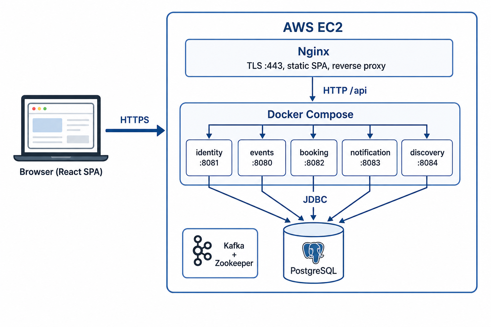
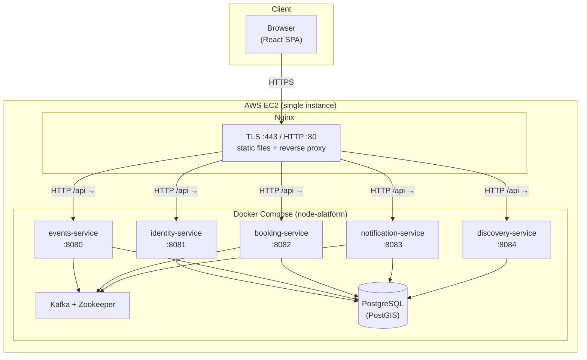

# Deployment diagram (production)

Simple view: **browser → EC2 → Nginx → Docker services → Postgres** (and Kafka for async traffic).

## Diagram (image)

*PNG generated for slides / reports. Edit the Mermaid block below if the architecture changes.*

## One-line description

Users hit **Nginx** on **EC2**; Nginx serves the **built React app** and forwards **`/api/v1/...`** to the right **Spring Boot** container. All services share **Postgres**; **Kafka** connects event/booking/notification flows.

## Optional: draw in PowerPoint / draw.io

Use three stacked **3D boxes**: **Browser** → **EC2 (Nginx)** → **EC2 (Docker + jars)** → **Postgres cylinder**. Label arrows **HTTPS** and **HTTP (reverse proxy)**.
