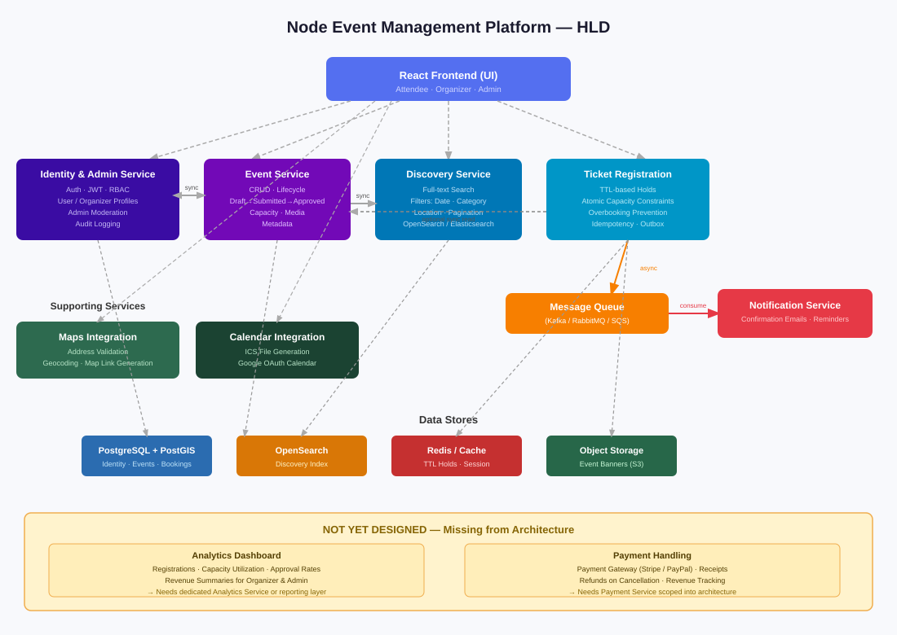

# High-Level Design (HLD) — Node Event Management Platform

## System Overview

### Objective
Build a scalable event management platform that allows:
- User authentication and RBAC
- Event creation and approval workflow
- Event discovery and search
- Count-based ticket registration
- Email confirmations and reminders
- Admin moderation
- Calendar and map integrations

---

## Architecture Diagram

---

## Core Services

### 1. Identity & Admin Service
*(Combined: Auth + Profile + Moderation)*

**Responsibilities:**
- User registration and login
- JWT issuance and refresh
- Role-based access control (Attendee, Organizer, Admin)
- User profile management
- Organizer profile management
- Admin event moderation (approve/reject)
- Audit logging

**Communication:**
- Sync calls from UI
- Sync calls to Event Service for approval actions

---

### 2. Event Service

**Responsibilities:**
- Event CRUD
- Draft → Submitted → Approved → Published lifecycle
- Capacity configuration (total seats)
- Media (banner references)
- Event metadata (time, location, category)

**Communication:**
- Sync with Identity & Admin Service for moderation
- Sync call to Discovery Service when event is published or updated

---

### 3. Discovery Service

**Responsibilities:**
- Full-text search
- Filters (date, category, location)
- Category browsing
- Pagination and sorting

**Storage:**
- Search index (OpenSearch / Elasticsearch)
- Derived from Event Service data

**Communication:**
- UI → Discovery Service (sync)
- Event Service → Discovery Service (sync reindex call or scheduled sync)

---

### 4. Ticket Registration Service

**Responsibilities:**
- Hold capacity with TTL-based reservations
- Confirm registration
- Enforce atomic capacity constraints
- Prevent overbooking
- Maintain idempotency
- Publish confirmation events via outbox pattern

**Communication:**
- UI → Registration Service (sync)
- Registration Service → Message Queue (async)
- Optional sync read validation from Event Service

---

### 5. Notification Service

**Responsibilities:**
- Consume `RegistrationConfirmed` events from the message queue
- Send confirmation emails
- Schedule and send event reminders

**Communication:**
- Consumes from message queue only
- No direct dependency from Registration Service

---

### 6. Supporting Services

#### Location / Maps Integration
- Address validation
- Geocoding
- Map link generation

#### Calendar Integration
- ICS file generation
- Google OAuth calendar integration

---

## What's Missing

### Analytics Dashboard
There is no service or component defined for analytics. Both admins and organizers require a dashboard showing platform-level and event-level metrics (e.g., registrations over time, capacity utilization, event approval rates, revenue summaries). This needs to be designed and added as either a dedicated Analytics Service or as an extension of the Event and Registration services with a reporting layer.

### Payment Handling for Paid Events
The platform supports paid events but there is no payment service or gateway defined in this design. This includes:
- Payment processing (Stripe, PayPal, or similar)
- Transaction records and receipts
- Refund handling on cancellation
- Revenue tracking for organizers

A dedicated Payment Service or integration with a third-party payment gateway needs to be scoped and added to the architecture.
